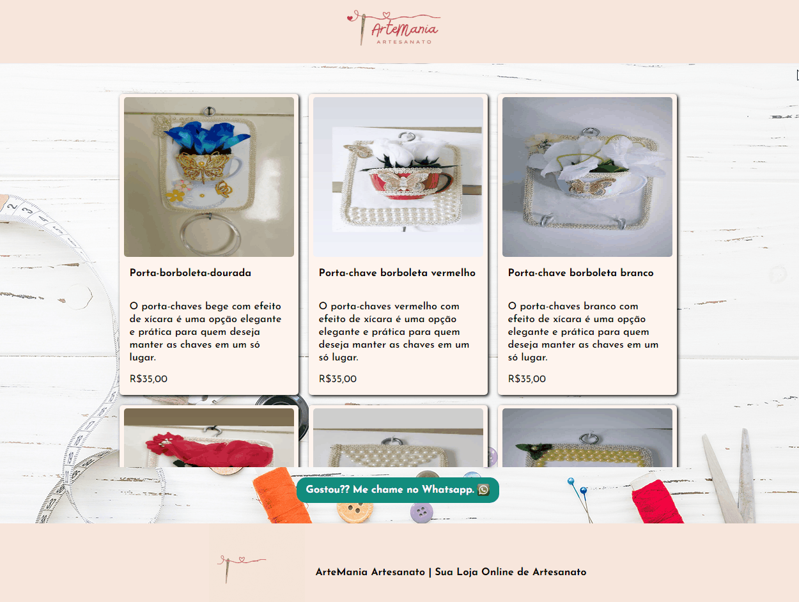

# ArteMania - Página Estática Freelancer em React

Bem-vindo ao repositório do ArteMania em React! Este projeto freelancer utiliza React para criar uma página estática que serve como vitrine para produtos artísticos e artesanais. Incluímos também um botão de WhatsApp para uma comunicação direta com o vendedor, proporcionando uma experiência de compra mais eficiente.

## Visão Geral

O ArteMania React tem como principais objetivos:

- **Exibir Produtos de Arte e Artesanato:** Utilizando componentes React, apresentamos de forma atrativa uma variedade de produtos artísticos e artesanais.

- **Facilitar a Comunicação:** Implementamos um botão de WhatsApp que leva os usuários diretamente ao contato com o vendedor, melhorando a interação e suporte ao cliente.

## Tecnologias Utilizadas

- **React:** Criação de componentes reutilizáveis para uma estrutura dinâmica.

- **CSS com Styled Components:** Estilização dos componentes e páginas de forma elegante e modular.

- **JavaScript (ES6+):** Implementação da funcionalidade do botão de WhatsApp e manipulação dinâmica da página.

## Como Visualizar o Projeto

1. **Clone o Repositório:**
   ```bash
   git clone https://github.com/seu-usuario/ArteMania-React.git


2. **Instale as Dependências:**
    ```bash
    cd ArteMania-React
    npm install

3. Inicie o Aplicativo:
    ```bash
    npm start
    ```

    Agora você pode explorar a vitrine do ArteMania React e utilizar o botão de WhatsApp para se comunicar diretamente com o vendedor!

    # Capturas de Tela
    <html></html>

    
